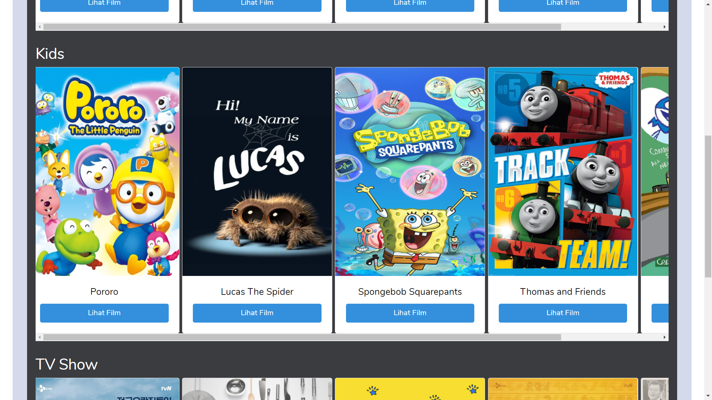

# Beeflix_Laravel
This is a project to fulfill mid exam at Website Programming subject.

## Descriptions
This website is an imitation of netflix, which provide movies to choose for details.

 In this project, you can see list movies, see details, and sort movies by genre

 Please have a quick look with project's preview below. Thank you!

## Run Guide
You can run this project by laravel command php artisan serve

## Project's Preview

 

 

 

 

## Technologies
▸ HTML 
▸ CSS 
▸ Javascript 
▸ PHP 
▸ Laravel 
▸ MVC Pattern 
▸ Visual Studio Code 
